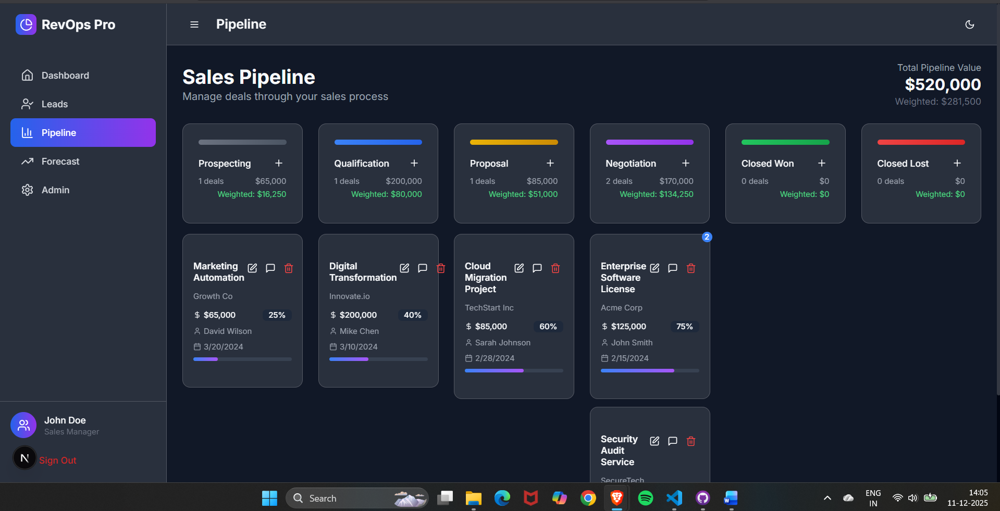

# Revenue Operation – AI‑Augmented Sales CRM (Next.js)

A modern, AI‑assisted Sales CRM built with Next.js App Router and Tailwind CSS. It provides views for Leads, Pipeline, Forecast, Dashboard, and Admin, plus a set of reusable UI components. This README documents what was built, the tools used, how to run it, and how it applies to real‑world scenarios.

## Overview

This project implements a multi‑page CRM interface:
- Dashboard: summary metrics and charts for sales performance.
- Leads: intake and management of leads; status, scoring, and actions.
- Pipeline: stage‑based view of opportunities.
- Forecast: simple ML/analytics‑driven projections UI.
- Admin: placeholder for administrative tasks and settings.

It uses a component‑driven design with a rich set of reusable UI primitives and patterns.

## Tech Stack

- Framework: Next.js (App Router, TypeScript)
- UI: Tailwind CSS, Radix UI patterns, custom components (in `components/ui`)
- Styling: Tailwind + PostCSS
- Charts/Widgets: lightweight custom components (`components/chart.tsx`, `components/ml-forecast-chart.tsx`, etc.)
- State/Utils: TypeScript utilities (`lib/utils.ts`), hooks (`hooks/*`)
- Build/Config: next.config.mjs, tailwind.config.ts, postcss.config.mjs, tsconfig.json

Optional (recommended for persistence):
- Database: PostgreSQL (via Prisma) or SQLite for local only
- ORM: Prisma (type‑safe client)

## Project Structure

- `app/` – Next.js App Router pages and layouts
  - `app/page.tsx` – Home
  - `app/dashboard/page.tsx` – Dashboard view
  - `app/leads/page.tsx` and `app/leads/loading.tsx` – Leads view and loading state
  - `app/pipeline/page.tsx` – Pipeline view
  - `app/forecast/page.tsx` – Forecast view
  - `app/admin/page.tsx` – Admin view
  - `app/layout.tsx` and `app/globals.css` – Root layout and global styles
- `components/` – Reusable UI components and domain widgets
- `hooks/` – Reusable React hooks
- `lib/` – Utilities and shared libs
- `public/` – Static assets
- `styles/` – Additional styles

## Key Features Implemented

- Responsive dashboard layout with componentized UI
- Leads management view scaffold with loading skeleton
- Pipeline stages page scaffold
- Forecast chart/widget placeholders for AI/ML integration
- Admin page scaffold for settings/roles
- Theme/animation providers and UX polish components
- Reusable, accessible UI primitives (accordion, dialog, forms, table, etc.)

## How It Applies in the Real World

This project mirrors how sales teams manage and optimize revenue operations:
- Leads: Collect, qualify, and prioritize leads to improve conversion rate.
- Pipeline: Visualize opportunities across stages to identify bottlenecks and forecast revenue.
- Forecast: Use historical data and simple ML/analytics to project bookings and set targets.
- Dashboard: Track KPIs (win rate, cycle time, ACV) to guide daily decisions.
- Admin: Configure stages, territories, and permissions for governance and scale.

These patterns map to common workflows in startups and enterprise sales teams, enabling data‑driven decision‑making and operational transparency.

## Screenshots

### Dashboard

Shows key KPIs like total revenue, active leads, win rate, and pipeline value, along with revenue vs forecast charts and pipeline distribution visualizations for quick health checks.[image:10][file:21]
### Dashboard – AI Insights

Section of the dashboard that surfaces AI-driven insights such as pipeline health, lead response time alerts, and seasonal trends with confidence scores and suggested actions.[image:2][file:21]

### Leads

Displays a card-based list of leads with qualification status, hotness score, contact details, deal value, and quick email/call actions, plus search and status filters for fast lookup.[image:8][file:21]
### Leads – Add Lead Modal

Modal form for adding a new lead with fields for contact info, source, and potential value, enabling quick creation of structured sales opportunities.[image:9][file:21]

### Pipeline

Provides a stage-based Kanban view of the sales pipeline, showing deals by stage, deal values, win probabilities, and total weighted pipeline so users can track opportunities visually.[image:6][file:21]

### Forecast

Shows revenue forecast KPIs (current, forecasted, and target revenue) with variance, plus AI revenue forecasting details and charts comparing predicted vs traditional revenue over time.[image:4][file:21]

### Forecast – ML Chart

Visualizes ML revenue forecast curves over months, highlighting predicted trends, confidence, and deviations from baseline to support data-driven planning.[image:5][file:21]
### Forecast – Traditional vs Actual

Chart comparing traditional revenue forecasts against actuals across quarters, helping users evaluate forecast accuracy and performance.[image:3][file:21]

### Admin

Admin panel for managing users, roles, and system health, showing total users, active users, admins, and last login details with edit/delete actions.[image:1][file:21]

### Admin – Flask / ML Integration

Integration view describing planned Flask API endpoints for AI lead scoring, revenue forecasting, pipeline insights, and data access, including notes about MySQL, SQLAlchemy, CORS, and JWT auth.[image:7][file:21]

## Getting Started

1) Install dependencies

   npm install

2) Run the dev server

   npm run dev

3) Open the app

   Visit http://localhost:3000
   
## Development Notes

- UI components live in `components/ui` and are designed to be composed in pages.
- Keep server‑side data fetching inside server components or route handlers for best performance and security.
- For charts/forecasting, replace placeholders with your preferred charting and ML libraries (e.g., `chart.js`, `recharts`, or server‑side Python services through an API route).

## Scripts

- `dev` – Start Next.js dev server
- `build` – Build for production
- `start` – Start production server

Check `package.json` for the full list.

## License

Personal/educational use by default. Add a license of your choice if distributing.

## Credits

- Next.js, Tailwind CSS, Radix UI patterns and community components
- Placeholder assets in `/public`

---

Replace screenshot placeholders and, if you introduce a database, document your schema decisions and migrations under a new section (e.g., `docs/data-model.md`).
